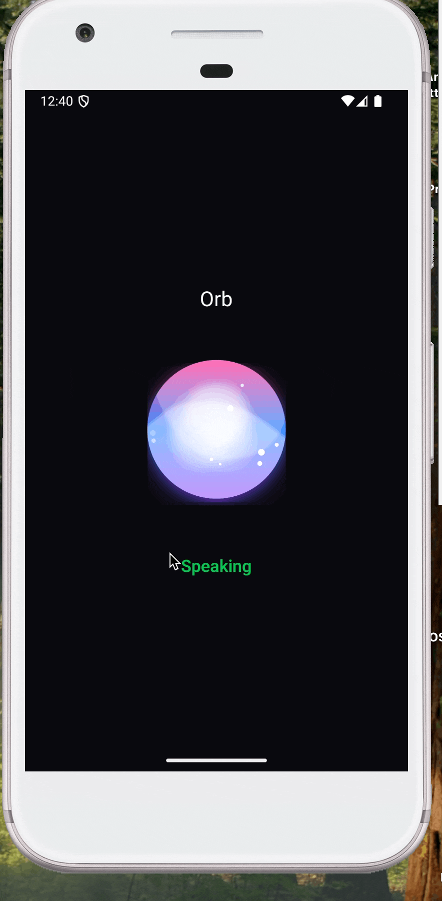

# expo-orb

An animated orb component for React Native with Expo. Renders a glowing, animated sphere with particles, wavy blobs, and customizable visual effects.

Inspired by and iOS implementation from [metasidd/Orb](https://github.com/metasidd/Orb)

## Demo

| iOS | Android |
|:---:|:-------:|
|  |  |

## Features

- Cross-platform support (iOS, Android, Web)
- Smooth 60fps animations
- Activity-based animation states (idle, speaking, etc.)
- Breathing animation effect
- Customizable colors, particles, and glow effects
- Native performance on iOS (SwiftUI/SpriteKit) and Android (Jetpack Compose)

## Installation

```bash
npm install expo-orb
```

For bare React Native projects, run `npx pod-install` after installation.

## Usage

```tsx
import { ExpoOrbView, setOrbActivity } from 'expo-orb';

function MyComponent() {
  return (
    <ExpoOrbView
      style={{ width: 200, height: 200 }}
      backgroundColors={['#7c3aed', '#3b82f6', '#ec4899']}
      glowColor="#ffffff"
      particleColor="#ffffff"
      showBackground={true}
      showWavyBlobs={true}
      showParticles={true}
      showGlowEffects={true}
      showShadow={true}
    />
  );
}

// Control animation intensity (0-1)
setOrbActivity(0.8); // Active/speaking state
setOrbActivity(0.1); // Idle state
```

## Props

| Prop | Type | Default | Description |
|------|------|---------|-------------|
| `backgroundColors` | `ColorValue[]` | `['green', 'blue', 'pink']` | Gradient colors for the orb background (min 2 colors) |
| `glowColor` | `ColorValue` | `'white'` | Color of the glow effects |
| `particleColor` | `ColorValue` | `'white'` | Color of floating particles |
| `coreGlowIntensity` | `number` | `1.0` | Intensity of the core glow effect (0+) |
| `breathingIntensity` | `number` | `0` | Intensity of breathing animation (0-1) |
| `breathingSpeed` | `number` | `0.25` | Speed of breathing animation |
| `showBackground` | `boolean` | `true` | Show/hide background gradient |
| `showWavyBlobs` | `boolean` | `true` | Show/hide animated wavy blob overlays |
| `showParticles` | `boolean` | `true` | Show/hide floating particles |
| `showGlowEffects` | `boolean` | `true` | Show/hide rotating glow effects |
| `showShadow` | `boolean` | `true` | Show/hide drop shadow |
| `speed` | `number` | `60` | Animation speed multiplier |
| `style` | `StyleProp<ViewStyle>` | - | Container style (set width/height here) |

## Methods

### `setOrbActivity(activity: number)`

Controls the orb's animation intensity. Pass a value between 0 and 1:

- `0` - Minimal activity (idle)
- `0.1-0.3` - Low activity
- `0.5-0.7` - Medium activity
- `0.8-1.0` - High activity (speaking/active)

This function bypasses React's prop system to prevent animation flickering during rapid updates.

```tsx
import { setOrbActivity } from 'expo-orb';

// Transition to speaking state
setOrbActivity(0.85);

// Return to idle
setOrbActivity(0.08);
```

## Example

See the `/example` directory for a complete working example with activity simulation.

```tsx
import * as React from 'react';
import { View } from 'react-native';
import { ExpoOrbView, setOrbActivity } from 'expo-orb';

export default function App() {
  React.useEffect(() => {
    // Simulate activity changes
    const interval = setInterval(() => {
      const activity = Math.random() > 0.5 ? 0.85 : 0.08;
      setOrbActivity(activity);
    }, 2000);

    return () => clearInterval(interval);
  }, []);

  return (
    <View style={{ flex: 1, alignItems: 'center', justifyContent: 'center' }}>
      <ExpoOrbView
        style={{ width: 220, height: 220 }}
        backgroundColors={['#7c3aed', '#3b82f6', '#ec4899']}
      />
    </View>
  );
}
```

## License

MIT
